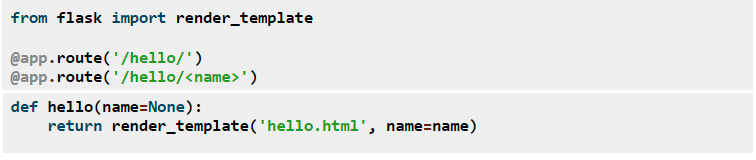
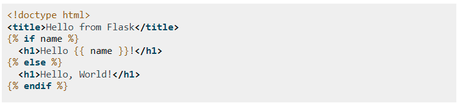
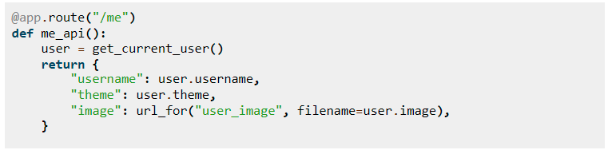
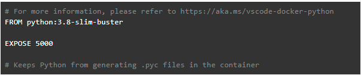
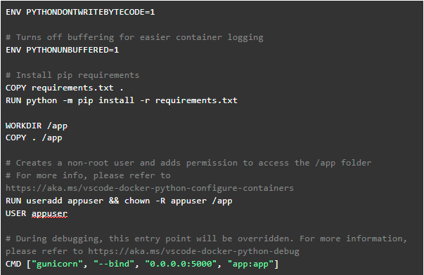

# Python Flask uso básico

### Introducción
#### Python
Python es un lenguaje de programación con un paradigma de programación  orientado a objetos. Un paradigma de programación es una forma de programación de software: un conjunto de métodos para el diseño de programas para resolver problemas computacionales.
La programación orientada a objetos se basa en el concepto de clases y objetos, donde se estructura un programa de software en partes simples y reutilizables de planos de código (clases) para crear instancias individuales de objetos. En vez de pensar en funciones, se piensa en las relaciones o interacciones de los diferentes componentes del sistema.
Python es de código abierto, por lo que se puede usar y distribuir libremente, incluso para uso comercial y presente en multitud de aplicaciones y sistemas operativos.  Tiene una sintaxis sencilla que facilita su aprendizaje con un código legible. Cuenta con una gran cantidad de herramientas, como frameworks para auxiliar el desarrollo web.
[https://profile.es/blog/que-es-la-programacion-orientada-a-objetos](https://profile.es/blog/que-es-la-programacion-orientada-a-objetos/)

#### API
API es una interfaz de programación de aplicaciones. Se trata de un conjunto de definiciones y protocolos que establece cómo un módulo de un software se comunica o interactúa con otro para cumplir funciones a través de un conjunto de reglas, siendo transparente al usuario final.
Las API se componen de dos elementos relacionados:
Una especificación que describe cómo se intercambia la información entre programas, hecha en forma de una solicitud de procesamiento y una devolución de los datos necesarios. 
Una interfaz de software escrita según esa especificación y publicada de alguna manera para su uso.

[https://www.redhat.com/es/topics/api/what-are-application-programming-interfaces](https://www.redhat.com/es/topics/api/what-are-application-programming-interfaces)
#### OpenAPI
El manual de uso para una API, utiliza el estándar OpenAPI. Es una documentación completa que permite comprender las capacidades de una API, sin necesidad de acceder al código fuente ni inspeccionar las peticiones. Un desarrollador puede comprender e interactuar con el servicio mucho más fácil.
Un archivo de OpenAPI nos permite describir los aspectos de una API como:  

- Información general sobre la API.

- Rutas disponibles (/ recursos).

- Operaciones disponibles en cada ruta.

- Entrada / Salida para cada operación.

Se genera en un formato legible para una máquina con JSON, definiendo una serie de propiedades que agrupan en clases y objetos.

[https://www.ionos.es/digitalguide/paginas-web/desarrollo-web/que-es-openapi/](https://www.ionos.es/digitalguide/paginas-web/desarrollo-web/que-es-openapi/)

#### Microframework
Una de las opciones para crear páginas web es el microframework Flask de Python.
Un framework son herramientas, utilidades y funciones que facilitan la construcción de páginas web dinámicas. Un microframework se enfoca en el manejo de solicitudes HTTP: recibe la solicitud, enruta al controlador designado y devuelve una respuesta.
Con Flask, se pueden agregar las dependencias que se necesiten. Si la aplicación requiere de más funcionalidades, se puede incorporar al proyecto las bibliotecas que se necesiten, empezando con un directorio de archivos con un solo archivo y llegar a miles de archivos si es necesario.

[https://flask.palletsprojects.com/en/1.1.x/](https://flask.palletsprojects.com/en/1.1.x/)

### Desarrollo
#### Entorno de programacion
Para usar Python Flask es necesario un entorno de programación. Por defecto python 3 ya viene con el módulo venv para crear entornos virtuales. 
El uso de entornos virtuales se debe a que al desarrollar una aplicación la misma puede requerir de una versión específica de librería, por lo tanto la versión de Python que se tenga instalada puede no cumplir con los requisitos específicos de la aplicación. Para evitar este problema se recurre al módulo venv que permite especificar estos entornos virtuales, los cuales son ambientes de ejecución aislados de la configuración del host que los contiene, y se puede crear tantos como se desee, cada uno con su propia distribución de Python y paquetes necesarios. Estos se organizan en un directorio que contiene archivos en forma de árbol.
Para instalar Flask y la herramienta virtualenv que permite tener entornos Python totalmente separados y aislados:
Cree una carpeta de proyecto y una carpeta venv dentro de:
```
mkdir myproject
```
```
cd myproject
```
```
python3 -m venv venv
```
Activar el entorno
```
. venv/bin/activate
```
Instalar Flask
```
pip install Flask
```
Instalar virtualenv
Si se usa Python 2, el módulo venv no está disponible. En su lugar, usar virtualenv.
```
sudo apt-get install python-virtualenv
```
#### Ejemplo para una aplicación
Con Flask se trabaja con un proyecto "limpio", donde a partir de sus módulos por default, solo se integra bibliotecas de terceros que sean necesarias, logrando un mayor control sobre el código.
La aplicación existe en un paquete (package), este es un subdirectorio que incluye un archivo _ _init_ _.py. Dentro del directorio de trabajo se crea el paquete app llamado app con el comando mkdir app que va a contener la aplicación a desarrollar. 
El archivo _ _init_ _.py crea el objeto app como una instancia de la clase flask importada del paquete flask.
app/_ _init_ _.py
```
from flask import Flask
app = Flask(__name__)
@app.route('/')
def hello_world():
    return 'Hello, World!'
```
Se pueden explicar cada una de las líneas en forma detallada:

> from flask import Flask 

Aquí se importa la clase Flask.

> app = Flask(__name__)

Importar dicha clase en una instancia llamada app. Para crear la instancia, se debe pasar como primer argumento el nombre del módulo o paquete de la aplicación, en este caso la palabra reservada es __name__. Esto es necesario para que Flask sepa donde encontrar las plantillas de la aplicación o los ficheros.  
Luego, Flask se encarga de hacer transparente el cómo a partir de una petición a una URL se ejecuta una rutina. Lo único que se tiene que hacer es añadir un decorador a nuestra función. En el ejemplo se llama a la  función hello_world que será invocada cada vez que se haga una petición a la URL raíz de la aplicación.  
El decorador route de la aplicación (app) @app.route es el encargado de decirle a Flask qué URL debe ejecutar su correspondiente función. Los decoradores modifican la función que los sigue. El nombre de la función es usado para generar internamente URLs a partir de dicha función.  
Finalmente, la función debe devolver la respuesta que es mostrada en el navegador del usuario.
del usuario.
#### Probar aplicación
Para ejecutar este archivo se puede usar el comando flask o el modificador -m de python con Flask
##### Opción 1:
```
export FLASK_APP=hello.py
```
```
flask run
```
Running on http://127.0.0.1:5000/
##### Opción 2:
```
export FLASK_APP=hello.py
```
```
python -m flask run
```
Running on http://127.0.0.1:5000/
Ambas opciones lanzan un servidor web, accesible solo por la misma computadora. Es bueno para realizar pruebas, pero no para usar en producción.
#### Plantillas de Flask (templates)
Generar HTML desde Python es bastante engorroso. Por eso, Flask configura el motor de plantillas Jinja2 automáticamente. Para renderizar una plantilla, puede usar el método __render_template ()__. Todo lo que tiene que hacer es proporcionar el nombre de la plantilla y las variables que desea pasar al motor de plantillas como argumentos de palabras clave. A continuación, se muestra un ejemplo sencillo de cómo renderizar una plantilla:

Por convención Flask buscará plantillas en la carpeta de templates. Un ejemplo puede ser una plantilla “hello.html” ubicada en /nombre_de_aplicación/templates/hello.html

#### Escribir API básica usando Flask (JSON)
Un formato común al escribir una API es JSON. Si tu variable de retorno (return) es un diccionario flask devuelve la información en el formato JSON.


### Docker y VS Code
Docker es una aplicación de código abierto que permite a los administradores crear, administrar, implementar y replicar aplicaciones usando contenedores. Los contenedores pueden considerarse como un paquete que alberga las dependencias que una aplicación requiere para ejecutarse a nivel de sistema operativo. Esto significa que cada aplicación implementada usando Docker reside en un entorno propio y sus requisitos se gestionan por separado.
[https://www.digitalocean.com/community/tutorials/how-to-build-and-deploy-a-flask-application-using-docker-on-ubuntu-18-04-es](https://www.digitalocean.com/community/tutorials/how-to-build-and-deploy-a-flask-application-using-docker-on-ubuntu-18-04-es)
#### Requisitos

##### Primero se debe tener instalado Visual Studio Code 
Descargar .deb de la pagina oficial (https://code.visualstudio.com/) e instalar con el siguiente comando:
```
sudo dpkg -i code_1.55.0-1617120720_amd64.deb
```
se puede correr con el comando:
```
code&
```

##### Tener instalado req. de python (PASOS)
En VS Code agregar la extensión de Python.
Hay que agregar ciertos paquetes de Python con:
```
sudo apt install python3-pip
```
En la carpeta del proyecto (folder proyect), crear el entorno virtual con:
```
python3 -m venv env
```
En VS Code ir a View > Command Palette y seleccionar Python: Select Interpreter. Este comando presenta una lista de intérpretes disponibles. Seleccionar el entorno virtual, en la carpeta del proyecto, que empieza con ./env o .\env.  
Para activar el entorno virtual ir a View > Terminal.
El entorno seleccionado aparece abajo a la derecha como:

> Python 3.8.5 64-bit (‘env’)

Actualizar pip e instalar FLask en el entorno virtual:
```
python -m pip install --upgrade pip
```
```
python -m pip install flask
```
Si se abre una nueva terminal, activar el entorno virtual con:

> source env/bin/activate

Con estos pasos se tiene un entorno listo para escribir un código Flask en VS Code, como el ejemplo de aplicación visto en la sección anterior.
[https://code.visualstudio.com/docs/python/tutorial-flask](https://code.visualstudio.com/docs/python/tutorial-flask)

##### Tener instalado Docker (PASOS)
    
1. Primero descargar el repositorio

```
sudo apt-get update
```
```
sudo apt-get install \
```
```
apt-transport-https \
```
```
ca-certificates \
```
```
curl \
```
```
gnupg \
```
```
lsb-release
```
   
2. LLave GPG:
```
curl -fsSL https://download.docker.com/linux/ubuntu/gpg | sudo gpg --dearmor -o /usr/share/keyrings/docker-archive-keyring.gpg
```
    
3. Configurar repositorio estable
```
echo \  "deb [arch=amd64 signed-by=/usr/share/keyrings/docker-archive-keyring.gpg] https://download.docker.com/linux/ubuntu \  $(lsb_release -cs) stable" | sudo tee /etc/apt/sources.list.d/docker.list > /dev/null
```
    
4. Instalar Docker  

```
sudo apt-get update
```  

```
sudo apt-get install docker-ce docker-ce-cli containerd.io
```  

5. Verificar que se instalo  

```
sudo docker run hello-world
```  
    
6. Agregar docker al grupo del usuario

```
sudo groupadd docker
```
```
sudo usermod -aG docker $USER
```
#### Configuración de Docker
Luego de contar con todos los requisitos previamente listados se procede a configurar la extensión de Docker desde

> View > Command Palettes > Docker: add Docker Files….:

1. Se selecciona la app con la que se trabajará,en este caso Python:Flask.
2. A continuación se debe seleccionar si se desea trabajar con Docker Compose (múltiples contenedores).
3. Especificar la ruta a al directorio de trabajo en donde se encuentra la app a implementar.
4. Elegir el puerto para el desarrollo local de la aplicación, para Flask por defecto será el puerto 5000 pero cualquier puerto sobre el 1024 servirá.
Con toda la configuración anterior especificada la extensión de Docker procede a crear los siguientes archivos:

    - Un *Dockerfile*.Este es un archivo que contiene todos los comandos necesarios para armar una imagen.



    - Un *.dockerignore*.Se utiliza para excluir ciertos archivos que al momento de armar una imagen.

    - En caso de no existir se crea un *requeriments.txt*.Se listan las dependencias necesarias para el desarrollo de la app, en este caso incluirá Flask (framework) y Gunicorn (Servidor web HTTP).

Finalmente para ejecutar la app en Docker en la opción Run and Debug se selecciona la opción *Docker:Python-Flask* y para comprobar que efectivamente se creó la imagen se puede listar la mismo con el comando *docker images* desde la terminal.